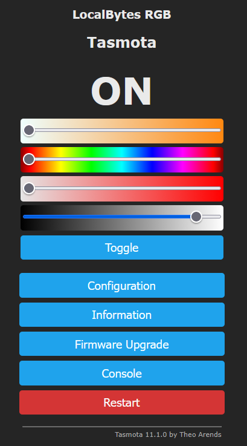
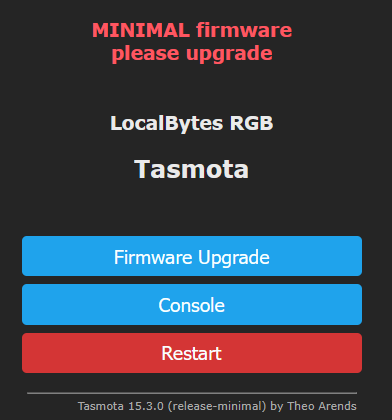
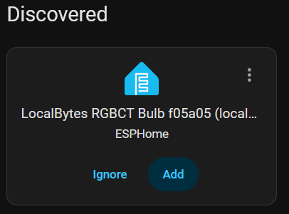
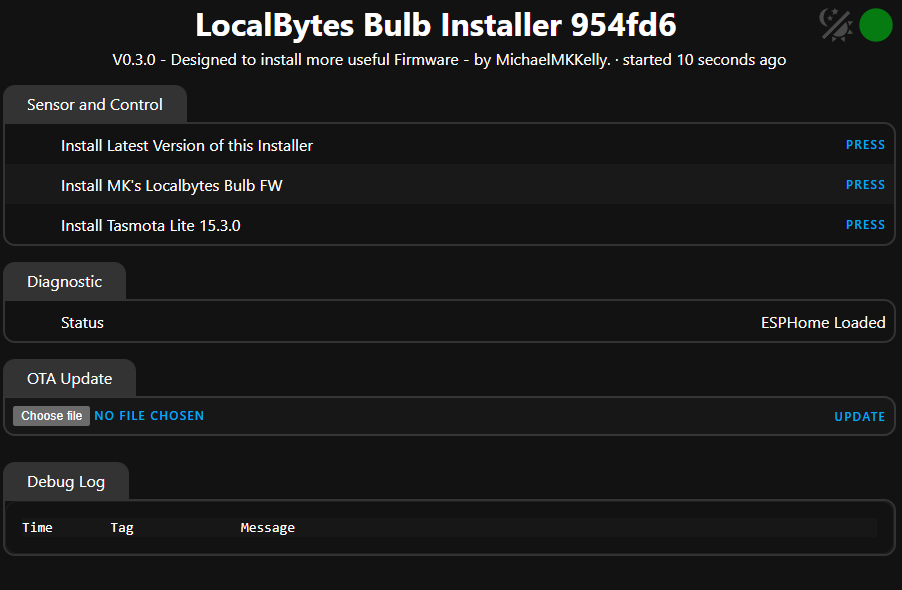

# ESPHome-Config-for-localbytes-bulb-9w-rgbct
ESPHome configuration for the LocalBytes RGB+CT smart bulb.

This repo contains an ESPHome config for the [Localbytes Bulb](https://www.mylocalbytes.com/products/smart-bulb-9w-rgbct).

The repo also contains an installer tool which may be useful to some. There is more information about it below.

## Disclaimer
I am not affiliated with LocalBytes in any way.

You are flashing a firmware onto your device which is not from the manufacturer. You should be careful when doing things like this and check where the firmware comes from and what it does.

## Why do this?

I prefer ESPHome to Tasmota for its customisability, consistency, and more simple integration with Home Assistant as it does not require MQTT.

There is no official configuration from LocalBytes.

There is a Repo By [JamesSwift](https://github.com/JamesSwift) located [HERE](https://github.com/JamesSwift/localbytes-bulb-9w-rgbct) however this repo is older and has not been updated to a modern version of ESPHome. I also had some issues with the release binaries.

Therefore I decided to put together a modern config setup with newer features that builds without issue on a more up to date version of ESPHome.

These bulbs are solid and are one of the few easy to get, reasonably priced, and customisable options that come in a B22 Version which is very common in the UK.

## The Device
Whilst labelled as a RGB+CT bulb, It is actually RGBWW Bulb and is a pretty standard device which we can build ESPhome targeting the ESP8266 (Specific board version: ESP8285).

## Features
- Wi-Fi Provisioning.
- IPv6 Support.
- Full compatibility with Home Assistant without any other setup.
- Full colour control as either RGB or as white with temperature control 3000-6000k.
- Brightness control.
- Lighting Effects:
    - Pulse
    - Fast Pulse
    - Slow Pulse
    - Asymmetrical Pulse
    - Random
    - Strobe
    - Flicker
- Power on default state can be set as:
    - Always Off
    - Always On
    - Restore Power Off State
- Update entity for updating to the latest version of firmware directly from Home Assistant.
- Device status diagnostic sensors.
- Factory Reset by power cycling 7 times within 10 seconds of each cycle.
- Option to Flash to the Installer Tool. See below for information. (Button disabled by default) NB: You will need to reconnect to your Wi-FI Network.

## Wishlist Features that are not implemented

### WebUI for direct control via browser
This is not currently able to be implemented due to limitations of the hardware, The firmware becomes too big. This may in theory be possible if I drop IPv6 Support but on balance I believe that IPv6 is more useful.

### Button to return to stock LocalBytes Firmware
Localbytes ship the bulb with an older version of Tasmota (11.1) that has a built-in Template. I have asked LocalBytes if they can make this firmware binary available so there can be potentially an option to return to stock. Hopefully it can be enabled in the main firmware but at the least it should hopefully be made available as an option in the Installer Firmware (information below).

## Install Instructions

### Basic Instructions
- Connect Bulb to your wifi network.
- Flash to tasmota-minimal.
- Flash to ESPHome Firmware.

### More Detailed Instructions
This explanation is for a brand new bulb and for someone with no experience so skip around or adjust as needed.
- Attach your new LocalBytes Bulb to power.
- It will broadcast a Wi-Fi Access point. Connect to this and use its web UI on 192.168.4.1 to input your WiFi-Network Credentials. During this process it should note its new IP address and attempt to redirect you.
- Once connected to your network and on the bulbs WebUI you are greeted with something like this:
  
  
- Select "Firmware Upgrade"
- We now want to move to "Tasmota Minimal" to ensure there is room on the bulb to be able to flash our new firmware.
- in the "Upgrade by web server" section you should see the following URL:
  `http://ota.tasmota.com/tasmota/release/tasmota.bin.gz`

  You should change this by adding `-minimal` to the file name so it should now be:

  `http://ota.tasmota.com/tasmota/release/tasmota-minimal.bin.gz`

  Then press "Start Upgrade".
- After a few moments you should be greeted with something like this:

   

   NB: Not directly related but worth noting that tasmota-minimal should only ever be flashed to a device already running tasmota like this. If you try to flash a minimal file to something not running tastmota it will brick the device and would require manual serial flashing. tasmota-lite is the smallest firmware to flash to a new device instead.
- Now we are ready to flash our new firmware so once again press on "Firmware Upgrade".
- Ensure you have the most recent localbytes-bulb.bin file from the releases section of this repo. (or lb-bulb-installer.bin if you are going that way instead - see below for more information)
- This time in the "Use file upload" section press on "Browse" then select the correct .bin file and then press "Start upgrade".
- After a moment the bulb will restart and disconnect from your Wi-Fi network.
- It should start broadcasting a new Wi-Fi access point (This time by ESPHome).
- Connect to this and use its web UI on 192.168.4.1 to input your WiFi-Network Credentials.
- Your newly flashed ESPHome Bulb should now be on your Wi-Fi Network.
- Now with some luck on the devices and settings page of Home Assistant you should see this:

  

- Add your new Bulb and have a good time.
- If it does not auto detect then you may have to manually add it to the ESPHome integration by IP address.

# Updating to a New Version
There is a built in update entity which should allow for easy updates using Home Assistant. For this to work the bulb must have access to the internet.

There is also a button that is disabled by default in the diagnostic section called "Firmware - Flash Forced Update". This button will start a firmware install to the latest version which means reinstalling it if you are already on latest. This can be used if the normal update entity is not working. For this to work the bulb must have access to the internet.

# The Bulb Installer Tool
Also In This Repo is a tool which once installed allows for you to download a selection of things on the device itself. This tool can also easily be flashed to from the bulb's web interface on the ESPHome configuration above.

Please note that the Bulb does not work as a bulb with this firmware active.

Currently you can download and install:
- The latest version of the tool itself.
- The latest version of the Bulb Firmware found in this repo.
- Tasmota Lite (15.3.0 as of time of writing).

NB: After installing a new firmware you will need to reconnect to your Wi-Fi Network.

You can also upload a firmware file on the WebUI if you want to install something else.

This is a handy way of having spare bulbs and such ready to go and when you pull them out you can select what you want to do and easily get the latest version of either the ESPHome setup or updating the installer and getting the most recently added version of Tasmota. Tasmota is not pointed at "latest" as I am yet to find an easy way to get MD5 hashes of the releases but this may change later.

## Why did I do this?
I wanted an option that allows for more flexible firmware choices. This is difficult to build into the standard firmware due to the limitations of the `ESP8285N08` in the bulb. However with optimisations and breakthroughs happening all the time in the ESPHome world... This may be addressed in the future.

## Ideas for other things that I could add to the list of options?

Raise an issue and I will have a look.

## Limitations
I was pretty limited with what could be done due to the space limitations of the device. I ended up turning off logging to save space. There is a text sensor which offers some information and feedback however it is limited which may affect troubleshooting options if you have any problems.

I also turned off the HomeAssistant API connection to save space so this tool needs to be operated from a browser only.

If there are issues safe mode is active so if ESPHome can it will go into safe mode and still connect to the network. You can then use the ESPHome tools to OTA firmware changes using their protocol which is enabled.

## What made this possible now?
ESPHome on the ESP8266 chip family had issues with retrieving files from HTTPS due to fixed size buffers which were not big enough. However in 2026.3 [THIS](https://github.com/esphome/esphome/pull/14009) PR was merged and released. This allows for the buffer to be configured. It was previously fixed at 512 bytes but now can be set up to 16384 bytes.

This makes it pretty easy (although it takes a bunch of firmware space) to install OTA updates via HTTPS requests now.

## Credits
- LocalBytes - For making/whitelabeling/selling the [Bulb](https://www.mylocalbytes.com/products/smart-bulb-9w-rgbct).
- ESPHome Team and the Open Home Foundation - For making [ESPHome](https://esphome.io/).
- JamesSwift - For their [Repo](https://github.com/JamesSwift/localbytes-bulb-9w-rgbct) which helped give me a start.
- Athom-Tech - For their [Configs](https://github.com/athom-tech/athom-configs) of similar devices that helped inspire large sections of this project.